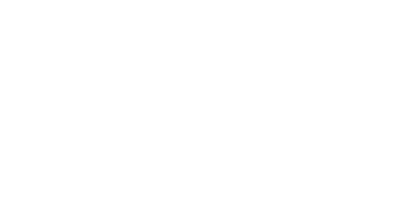

#

 Gakuciv is a mod for Unciv that acts as a vanilla+ type mod. More nations, more techs, more buildings, and more depth.

This project is no longer supported as of 10/12/2024.

## Features
### Kievan Rus' 
Kievan Rus is a full new Civ, with Vladimir the Great as their leader. Their focus is Religion and Gold, but while their military is formed mostly of untrained militia, their numbers are large and their faith is something to revere.
### Religious Victory
Adds a Religious Victory condition, where you must spread your religion all over the world and build the Church of the Heavens to win.
### Reworked Culture Victory
Still a WIP. The Culture Victory is being reworked so that, similar to BNW, it is won through tourism rather than researching 5 policy branches.
### Great Musicians
A new type of Great Person that can trigger a Great Concert event and build a Great Stadium.

## To Do
This section is mostly for the dev
* Add new stuff to Recording and Advanced Physics (tech column 11)
